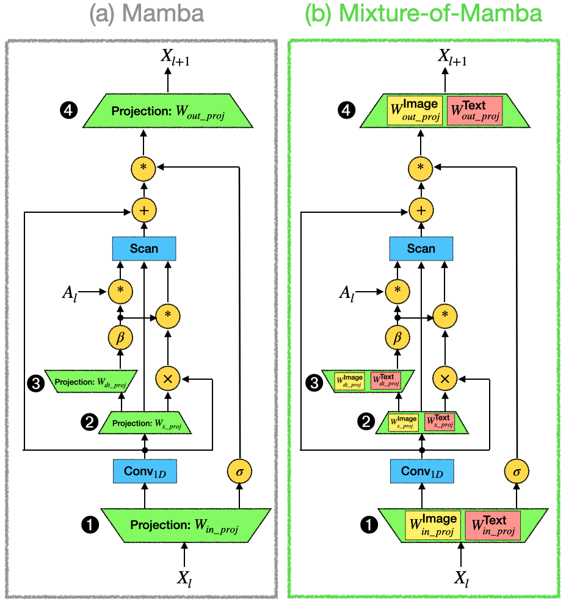
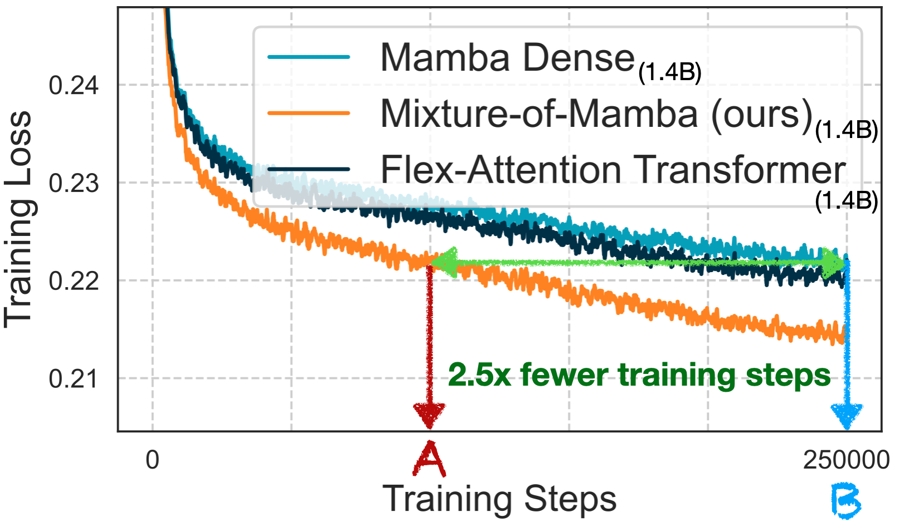

# Mixture-of-Mamba

Official implementation of "Mixture-of-Mamba: Enhancing Multi-Modal State-Space Models with Modality-Aware Sparsity"
[[Paper]](http://arxiv.org/abs/2501.16295)




## Overview

Mixture-of-Mamba introduces modality-aware sparsity to State Space Models (SSMs) through modality-specific parameterization of the Mamba block. Our approach extends the benefits of modality-aware sparsity to SSMs while preserving their computational efficiency. Key features include:

- Modality-specific parameterization of key projection components in the Mamba block
- Efficient training with significantly reduced computational costs
- Strong performance across multiple multi-modal pretraining settings:
  - Transfusion: 34.76% FLOPs to match baseline at 1.4B scale
  - Chameleon: 42.50% FLOPs for image, 65.40% for text at 1.4B scale
  - Three-modality: 24.80% FLOPs for speech at 1.4B scale




## Installation

See [https://github.com/state-spaces/mamba](https://github.com/state-spaces/mamba).

## Repository Structure

- `MixtureOfMamba.py`: Core implementation of our Mixture-of-Mamba architecture
- `BaselineDenseMamba.py`: Reference implementation of dense Mamba baseline
- `example_use.py`: Example code demonstrating initialization and usage

## Usage

Here's how to use Mixture-of-Mamba in your projects:

```python
from MixtureOfMamba import MixtureOfMamba

# Initialize your configuration
# You'll need to implement your own config class with required attributes
class ModelConfig:
    def __init__(self):
        self.use_MixtureOfMamba = True  # Enable Mixture-of-Mamba
        self.use_BaselineDenseMamba = False  # Disable dense Mamba

        self.do_not_split_in_proj = False  # Do not split in_proj in Mamba block
        self.do_not_split_x_proj = False  # Do not split x_proj in Mamba block
        self.do_not_split_dt_proj = False  # Do not split dt_proj in Mamba block
        self.do_not_split_out_proj = False  # Do not split out_proj in Mamba block

        ...                             # Other required configurations

# Create model instance
model = MixtureOfMamba(
    args=ModelConfig(),
    d_model=768,         # Model dimension
    d_state=16,          # SSM state expansion factor
    d_conv=4,            # Local convolution width
    expand=2,            # Block expansion factor  
    # This configuration uses roughly 3 * expand * d_model^2 parameters
)

# Forward pass with modality-specific inputs
output = model(
    hidden_states,            # Input tensor of shape [batch_size, seq_len, dim]
    modality_masks=modality_masks  # Tensor indicating modality of each token
)
```

See `example_use.py` for more detailed usage examples.

## Citation

If you find this code useful for your research, please cite our paper:

```bibtex
@article{liang2025mambamixture,
  title={Mixture-of-Mamba: Enhancing Multi-Modal State-Space Models with Modality-Aware Sparsity},
  author={Liang, Weixin and Shen, Junhong and Zhang, Genghan and Dong, Ning and Zettlemoyer, Luke and Yu, Lili},
  journal={arXiv preprint arXiv:2501.16295},
  year={2025}
}
```

## License

See LICENSE file for details

## Acknowledgements

The baseline Mamba implementation is adapted from [https://github.com/state-spaces/mamba](https://github.com/state-spaces/mamba).

## Contact

For questions or issues, please open an issue in the repository. 
